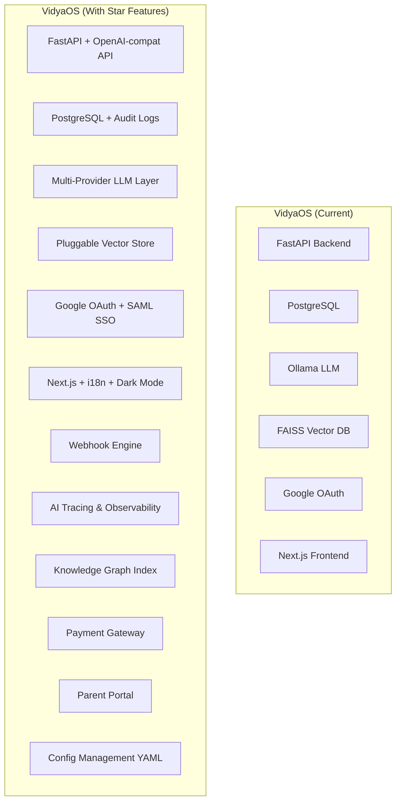

# VidyaOS — Star Feature Analysis & Documentation Enhancement Report

**Project:** VidyaOS – AI Infrastructure for Educational Institutions  
**Date:** 2026-03-02  
**Scope:** Analysis of raw documentation (11 docs) + 5 reference repositories

---

## 1. Executive Summary

This report analyzes the raw documentation for VidyaOS (`proxy_notebooklm/raw`) against **5 industry-leading repositories** to identify "star features" — capabilities that are either **missing**, **under-documented**, or could be **significantly enhanced** by learning from production-grade open-source projects.

### Reference Repositories Analyzed

| Repository | Domain | Key Strength |
|---|---|---|
| **LangChain** | LLM Framework | Agent orchestration, modular integrations, observability (LangSmith) |
| **LlamaIndex** | Data Framework for LLMs | Data connectors, advanced RAG pipeline, hierarchical indexing |
| **PrivateGPT** | Privacy-first local LLM | OpenAI-compatible API, dependency injection, multi-provider support |
| **SaaS Starter Kit** (BoxyHQ) | Enterprise SaaS Boilerplate | SAML SSO, audit logs, webhooks, Stripe billing, RBAC, team management |
| **OpenEduCat** | Education ERP | Modular academic management, admissions, exams, fees, library, parent portal |

---

## 2. Raw Documentation Inventory

All 11 raw docs were analyzed in full:

| # | Document | Focus Area | Lines | Quality |
|---|---|---|---|---|
| 1 | System Overview | Executive summary, architecture philosophy | 323 | ✅ Strong |
| 2 | Architecture | System topology, layered architecture | 439 | ✅ Strong |
| 3 | AI Engine Deep Design | RAG pipeline, embedding, retrieval, LLM inference | 480 | ✅ Strong |
| 4 | Database Schema | PostgreSQL multi-tenant schema | 438 | ✅ Strong |
| 5 | Filtering Logic | Tenant isolation, RBAC, AI filtering | 1005 | ⚠️ Duplicated content |
| 6 | Hosting & Dev Env | Cloud/local infrastructure, deployment | 426 | ✅ Strong |
| 7 | Tech Stack | Frontend, backend, AI, infrastructure choices | 348 | ✅ Strong |
| 8 | UI Design | Visual identity, components, accessibility | 401 | ✅ Strong |
| 9 | Security Checks | Auth, network, AI, compliance | 458 | ✅ Strong |
| 10 | Admin Dashboard | Governance control center | 472 | ✅ Strong |
| 11 | Sitemap & Wireframe | Page structure, wireframes, navigation | 989 | ⚠️ Duplicated with AI Engine doc |

---

## 3. Star Features Extracted by Repository

### 3.1 ⭐ From LangChain — Agent Orchestration & Observability

| Star Feature | Description | VidyaOS Gap |
|---|---|---|
| **Agent Orchestration (LangGraph)** | Multi-step, stateful workflows with human-in-the-loop | VidyaOS docs mention "Task Template Engine" but lack explicit workflow orchestration or multi-step chains |
| **LangSmith Observability** | Full trace, eval, and debug pipeline for LLM apps | VidyaOS "Observability" section (§15 in AI Engine) is metric-only; lacks **trace-level debugging** of individual AI queries |
| **Modular Integrations Ecosystem** | 300+ integration packages via pluggable architecture | VidyaOS has hardcoded stack (Ollama + Qwen + FAISS); no **plugin architecture** for swapping providers |
| **Chat LangChain (Docs-as-AI)** | AI chatbot trained on its own documentation | Not present in VidyaOS — could enable **self-service support AI** |

**Recommended Documentation Additions:**
- Add **"AI Workflow Orchestration"** section documenting multi-step chains (e.g., Weak Topic → Fetch Notes → Generate Guide → Generate Quiz)
- Add **"AI Query Tracing & Debugging"** section with trace IDs, request replay, and response evaluation
- Add **"Provider Abstraction Layer"** section documenting how to swap LLM/embedding/vector providers

---

### 3.2 ⭐ From LlamaIndex — Advanced RAG & Data Connectors

| Star Feature | Description | VidyaOS Gap |
|---|---|---|
| **Data Connectors (LlamaHub)** | 300+ connectors for diverse data sources | VidyaOS supports PDF, DOCX, YouTube only; lacks **Google Docs, Notion, Slides, Excel, PPTX** |
| **Advanced Indexing (VectorStoreIndex, KnowledgeGraph)** | Multiple index types for different query needs | VidyaOS uses flat vector index only; lacks **knowledge graph index** or **summary index** |
| **LlamaParse (Agentic OCR)** | Advanced document parsing with 130+ format support | VidyaOS uses basic PyMuPDF; lacks **table extraction**, **image OCR**, **form parsing** |
| **Instrumentation & Observability** | Built-in instrumentation module (`llama-index-instrumentation`) | VidyaOS monitoring is infrastructure-level; lacks **AI pipeline instrumentation** |
| **Query Transform (HyDE, Sub-questions)** | Advanced query rewriting techniques | Not mentioned in VidyaOS docs |

**Recommended Documentation Additions:**
- Add **"Supported Data Sources & Connectors"** specification with expansion roadmap
- Add **"Index Types & Query Strategies"** documenting when to use vector vs knowledge graph vs summary index
- Add **"Document Parsing Pipeline"** with table extraction, OCR, and form handling specs
- Add **"Query Transform Strategies"** section covering HyDE, sub-question decomposition

---

### 3.3 ⭐ From PrivateGPT — Privacy-First Local Inference

| Star Feature | Description | VidyaOS Gap |
|---|---|---|
| **OpenAI-compatible API** | Drop-in replacement for OpenAI API standard | VidyaOS API is custom; no mention of **OpenAI API compatibility** for third-party tool integration |
| **Multi-mode UI (RAG, Search, Basic, Summarize)** | Configurable UI modes with different system prompts | VidyaOS has Q&A/Study Guide/Quiz modes but lacks **configurable system prompts per mode** in docs |
| **Dependency Injection Architecture** | Clean DI for swapping components | VidyaOS architecture docs don't specify a **DI pattern** for component swappability |
| **Multi-provider Backend Support** | Ollama, LlamaCPP, OpenAI, Azure, Gemini, SageMaker, vLLM | VidyaOS docs specify single-provider (Ollama); lacks **multi-provider configuration** |
| **Configurable RAG Settings** | `similarity_top_k`, `rerank`, `similarity_value` exposed via YAML | VidyaOS RAG parameters are hardcoded in docs; no **configurable settings file** spec |
| **Document Ingestion Watch** | Automated folder watching for new documents | Not present in VidyaOS |

**Recommended Documentation Additions:**
- Add **"API Compatibility Layer"** section specifying OpenAI API compatibility for ecosystem integration
- Add **"Configuration Management"** specification with YAML-based settings for all AI parameters
- Add **"Multi-Provider Support"** documenting how to switch between Ollama, vLLM, cloud providers
- Add **"Automated Ingestion"** section for folder-watch and scheduled ingestion pipelines

---

### 3.4 ⭐ From SaaS Starter Kit — Enterprise SaaS Features

| Star Feature | Description | VidyaOS Gap |
|---|---|---|
| **SAML SSO + Directory Sync (SCIM)** | Enterprise SSO with automated user provisioning | VidyaOS uses Google OAuth only; lacks **SAML SSO for school IT systems** |
| **Webhook & Event System (Svix)** | Event-driven architecture for CRUD operations | VidyaOS has no **webhook/event system** documented |
| **Audit Logging (Retraced)** | Comprehensive who-did-what-when logging | VidyaOS has basic `audit_logs` table but lacks **structured audit log specification** |
| **Stripe Payments Integration** | Complete billing, subscriptions, webhooks | VidyaOS Billing Panel is "informational only"; lacks **payment integration spec** |
| **Team/Org Management** | Create, invite, manage team members with roles | VidyaOS tenant model is admin-managed; lacks **self-service team management** |
| **Internationalization (i18n)** | Full multi-language support | Not mentioned in VidyaOS; critical for **Indian language support** |
| **Dark Mode** | User preference for dark/light theme | VidyaOS UI Design explicitly forbids dark theme; could be an **accessibility option** |
| **Security Headers** | CSP, HSTS, X-Frame-Options etc. | VidyaOS Security doc mentions HSTS but lacks **comprehensive security header spec** |
| **E2E Testing (Playwright)** | Automated browser testing | Not present in VidyaOS documentation |

**Recommended Documentation Additions:**
- Add **"Enterprise Authentication"** section with SAML SSO and Directory Sync specs for larger schools
- Add **"Event & Webhook System"** specification for integration with external school systems
- Add **"Audit Log Specification"** with structured event types, retention, and compliance
- Add **"Payment & Billing Integration"** specification (Razorpay for India market)
- Add **"Internationalization (i18n)"** strategy for regional Indian languages
- Add **"E2E Testing Strategy"** section with Playwright test specifications

---

### 3.5 ⭐ From OpenEduCat — Education-Specific ERP

| Star Feature | Description | VidyaOS Gap |
|---|---|---|
| **Admissions & Registration Module** | Complete enrollment workflow | VidyaOS has user management but **no admission workflow** documented |
| **Fee & Finance Management** | Invoicing, fee collection, financial reporting | VidyaOS has billing panel but **no fee management for schools** |
| **Library Management** | Book lending, cataloging | Not present in VidyaOS; could integrate with **AI document retrieval** |
| **Parent Portal** | Parent access to student data | Mentioned as future enhancement only; needs **specification** |
| **Transport & Hostel Management** | Logistics modules | Not applicable to core VidyaOS but shows **modular architecture** |
| **Activity Management** | Extra-curricular tracking | Could complement **student performance-aware tutoring** |
| **Modular Plugin Architecture** | Each feature as independent installable module | VidyaOS lacks a **formal module/plugin system** |

**Recommended Documentation Additions:**
- Add **"Admission Workflow"** specification for student onboarding pipeline
- Add **"Fee Management Module"** specification with recurring billing and payment tracking
- Add **"Parent Portal"** specification with limited role-based access
- Add **"Module Registry"** architecture for pluggable feature modules

---

## 4. Documentation Quality Issues Found

### 4.1 Duplicated Content
- **Filtering Logic.md** contains the entire document duplicated (same content appears twice ~507 lines onwards)
- **Sitemap & Wireframe.md** includes a full copy of **AI Engine Deep Design** starting at line 498

### 4.2 Missing Documentation
| Missing Doc | Priority | Justification |
|---|---|---|
| **API Reference / OpenAPI Spec** | 🔴 Critical | No API endpoint documentation exists |
| **Getting Started / Quickstart** | 🔴 Critical | No developer onboarding guide |
| **Contribution Guide** | 🟡 Important | All reference repos have CONTRIBUTING.md |
| **Changelog** | 🟡 Important | No version tracking |
| **Testing Strategy** | 🟡 Important | No test specification |
| **CI/CD Pipeline Spec** | 🟢 Nice-to-have | Mentioned but not specified |
| **Performance Benchmarks** | 🟢 Nice-to-have | No baseline metrics documented |

---

## 5. Prioritized Feature Implementation Roadmap

### Phase 1 — Critical Gaps (Week 1-2)

| # | Feature | Source Repo | Impact |
|---|---|---|---|
| 1 | **API Reference (OpenAPI Spec)** | PrivateGPT, LangChain | Without this, no one can integrate |
| 2 | **Configuration Management (YAML)** | PrivateGPT | Enables deployment flexibility |
| 3 | **Multi-Provider Support** | PrivateGPT | Vendor independence |
| 4 | **AI Query Tracing** | LangChain (LangSmith) | Essential for debugging & quality |
| 5 | **Getting Started Guide** | All repos | Developer adoption |

### Phase 2 — Enterprise Features (Week 3-4)

| # | Feature | Source Repo | Impact |
|---|---|---|---|
| 6 | **SAML SSO** | SaaS Starter Kit | Enterprise school adoption |
| 7 | **Webhook/Event System** | SaaS Starter Kit | Third-party integration |
| 8 | **Structured Audit Logs** | SaaS Starter Kit | Compliance readiness |
| 9 | **Payment Integration (Razorpay)** | SaaS Starter Kit | Revenue enablement |
| 10 | **Parent Portal** | OpenEduCat | Stakeholder engagement |

### Phase 3 — Advanced AI Features (Week 5-6)

| # | Feature | Source Repo | Impact |
|---|---|---|---|
| 11 | **Extended Data Connectors** | LlamaIndex | Broader document support |
| 12 | **Knowledge Graph Index** | LlamaIndex | Better concept mapping |
| 13 | **Query Transform (HyDE)** | LlamaIndex | Better retrieval quality |
| 14 | **AI Workflow Orchestration** | LangChain | Complex tutoring flows |
| 15 | **Document Ingestion Watch** | PrivateGPT | Automated updates |

### Phase 4 — Scale & Polish (Week 7-8)

| # | Feature | Source Repo | Impact |
|---|---|---|---|
| 16 | **Internationalization (i18n)** | SaaS Starter Kit | Regional language support |
| 17 | **E2E Testing (Playwright)** | SaaS Starter Kit | Quality assurance |
| 18 | **Fee Management Module** | OpenEduCat | School financial workflow |
| 19 | **Admission Workflow** | OpenEduCat | Student onboarding |
| 20 | **Module Plugin Architecture** | OpenEduCat | Extensibility |

---

## 6. Architecture Comparison Matrix

---

## 7. Per-Document Enhancement Recommendations

### 7.1 System Overview.md
- ✅ Add **API Compatibility** section (from PrivateGPT)
- ✅ Add **Plugin/Module Architecture** philosophy (from OpenEduCat)
- ✅ Add **Testing Strategy** as a core principle (from SaaS Starter Kit)

### 7.2 Architecture.md  
- ✅ Add **Dependency Injection Layer** (from PrivateGPT)
- ✅ Add **Event Bus / Webhook Layer** in topology (from SaaS Starter Kit)
- ✅ Add **Multi-Provider Abstraction** in AI System Architecture (from PrivateGPT)
- ✅ Add **Knowledge Graph** as secondary index type (from LlamaIndex)

### 7.3 AI Engine Deep Design.md
- ✅ Add **Query Transform Strategies** (HyDE, sub-questions) (from LlamaIndex)
- ✅ Add **AI Pipeline Instrumentation** with trace IDs (from LangChain)
- ✅ Add **Multi-step Workflow Orchestration** (from LangChain LangGraph)
- ✅ Add **Configurable RAG Parameters** via YAML (from PrivateGPT)
- ✅ Add **Advanced Document Parsing** (table extraction, OCR) (from LlamaIndex LlamaParse)

### 7.4 Database Schema.md
- ✅ Add **Webhook Events Table** (from SaaS Starter Kit)
- ✅ Add **Admission/Registration Tables** (from OpenEduCat)
- ✅ Add **Fee/Payment Tables** (from OpenEduCat + SaaS Starter Kit)
- ✅ Add **Parent User Role** and relations (from OpenEduCat)
- ✅ Add **Structured Audit Log Schema** with action types enum (from SaaS Starter Kit Retraced)

### 7.5 Filtering Logic.md
- ⚠️ **Remove duplicate content** (lines 508-1005 are copy-paste)
- ✅ Add **Parent role filtering rules** (from OpenEduCat)

### 7.6 Hosting & Dev Env.md
- ✅ Add **Docker Multi-stage Build** specification (from PrivateGPT)
- ✅ Add **Multiple Settings Files** per environment (from PrivateGPT)
- ✅ Add **E2E Test Infrastructure** (from SaaS Starter Kit)

### 7.7 Tech Stack.md
- ✅ Add **Testing Stack** (Playwright, pytest) (from SaaS Starter Kit)
- ✅ Add **i18n Stack** (next-i18next or equivalent) (from SaaS Starter Kit)
- ✅ Add **Event/Webhook Stack** (Svix or equivalent) (from SaaS Starter Kit)
- ✅ Add **Payment Stack** (Razorpay) (from SaaS Starter Kit Stripe)

### 7.8 UI Design.md
- ✅ Add **Dark Mode as Accessibility Option** consideration
- ✅ Add **i18n/RTL Layout** considerations
- ✅ Add **Parent Portal UI** specifications (from OpenEduCat)
- ✅ Add **AI Trace Viewer** component spec for admin debugging (from LangChain)

### 7.9 Security Checks.md
- ✅ Add **SAML SSO Security** requirements (from SaaS Starter Kit)
- ✅ Add **Security Headers Specification** (CSP, X-Frame-Options) (from SaaS Starter Kit)
- ✅ Add **Webhook Signature Verification** (from SaaS Starter Kit)
- ✅ Add **reCAPTCHA / Bot Protection** (from SaaS Starter Kit)

### 7.10 Admin Dashboard.md
- ✅ Add **AI Query Trace Viewer** panel (from LangChain LangSmith)
- ✅ Add **Webhook Management** panel (from SaaS Starter Kit)
- ✅ Add **Admission Pipeline** dashboard (from OpenEduCat)
- ✅ Add **Fee Collection** dashboard (from OpenEduCat)

### 7.11 Sitemap & Wireframe.md
- ⚠️ **Remove duplicate AI Engine content** (lines 498-989)
- ✅ Add **Parent Portal** sitemap and wireframes (from OpenEduCat)
- ✅ Add **Settings / Configuration** pages for AI parameters (from PrivateGPT)
- ✅ Add **Webhook Management** pages (from SaaS Starter Kit)

---

## 8. Conclusion

VidyaOS has **strong foundational documentation** covering architecture, AI engine, database, security, and UI design. However, when benchmarked against leading open-source projects, there are significant opportunities to:

1. **From LangChain**: Add agent orchestration, query tracing, and observability
2. **From LlamaIndex**: Expand data connectors, add knowledge graph indexing, and advanced parsing
3. **From PrivateGPT**: Implement OpenAI API compatibility, multi-provider support, and YAML configuration
4. **From SaaS Starter Kit**: Add enterprise features (SSO, webhooks, audit logs, payments, i18n)
5. **From OpenEduCat**: Complete ERP coverage (admissions, fees, parent portal, library)

Implementing these star features will transform VidyaOS from a prototype documentation set into an **enterprise-grade, production-ready platform specification** capable of competing in the EdTech SaaS market.
