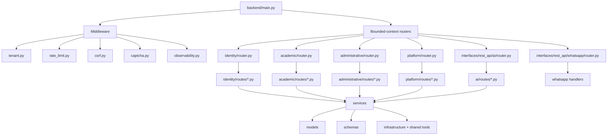
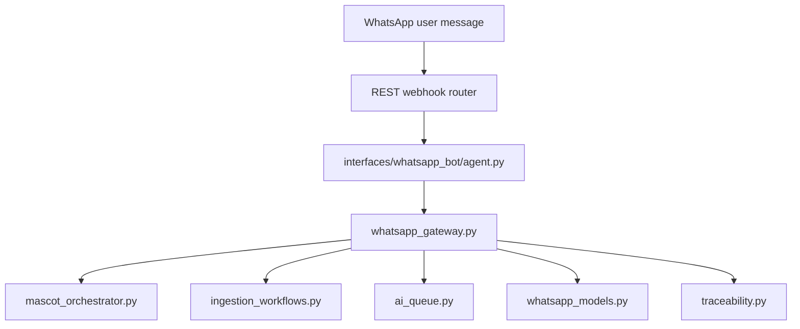
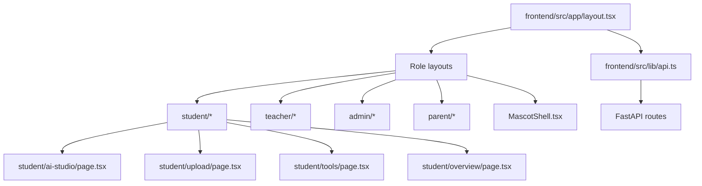

# System Architecture Map

This document describes the current application architecture and shows where the main files sit in that architecture.

## 1. High-Level System Diagram

```mermaid
flowchart LR
    U[Users\nStudent | Teacher | Parent | Admin | WhatsApp] --> FE[Next.js Frontend\nfrontend/src/app]
    U --> WA[WhatsApp Channel\nbackend/src/interfaces/whatsapp_bot]
    FE --> API[FastAPI Backend\nbackend/main.py]
    WA --> API

    API --> MW[Middleware Layer\nbackend/middleware]
    API --> ID[Identity Domain\nbackend/src/domains/identity]
    API --> AC[Academic Domain\nbackend/src/domains/academic]
    API --> AD[Administrative Domain\nbackend/src/domains/administrative]
    API --> PL[Platform Domain\nbackend/src/domains/platform]
    API --> AI[AI REST Interface\nbackend/src/interfaces/rest_api/ai]

    AI --> WF[AI Workflows\nworkflows.py | ingestion_workflows.py | discovery_workflows.py]
    WF --> TOOLS[Study Tools\nbackend/src/shared/ai_tools]
    WF --> LLM[LLM + Embeddings\nbackend/src/infrastructure/llm]
    WF --> VDB[Vector Retrieval / Notebook Context]
    WF --> OCR[OCR Imports\nbackend/src/shared/ocr_imports.py]

    PL --> QUEUE[AI Queue + Worker Runtime\nai_queue.py | worker_runtime.py]
    PL --> MASCOT[Mascot Orchestrator\nmascot_orchestrator.py]
    PL --> GOV[Usage Governance\nusage_governance.py]
    PL --> TRACE[Traceability + Observability\ntraceability.py | metrics_registry.py | alerting.py]

    API --> DB[(Postgres / SQLite via SQLAlchemy)]
    LLM --> EXT[External AI Providers]
    VDB --> EXT
    WA --> EXT
```

## 2. Runtime Entry Points

### Backend entry

- `backend/main.py`
  - creates the FastAPI app
  - wires middleware
  - wires all routers
  - exposes `/health`, `/ready`, `/metrics`

### Frontend entry

- `frontend/src/app/layout.tsx`
- role layouts:
  - `frontend/src/app/student/layout.tsx`
  - `frontend/src/app/teacher/layout.tsx`
  - `frontend/src/app/admin/layout.tsx`
  - `frontend/src/app/parent/layout.tsx`

### WhatsApp entry

- `backend/src/interfaces/whatsapp_bot/agent.py`
- `backend/src/interfaces/rest_api/whatsapp/router.py`

## 3. Backend Layer Diagram



## 4. Bounded Contexts and Key Files

### Identity

Handles auth, tenants, onboarding, SSO, invitations.

Main files:

- `backend/src/domains/identity/router.py`
- `backend/src/domains/identity/routes/auth.py`
- `backend/src/domains/identity/routes/onboarding.py`
- `backend/src/domains/identity/routes/enterprise.py`
- `backend/src/domains/identity/models/user.py`
- `backend/src/domains/identity/models/tenant.py`

### Academic

Handles student, teacher, parent learning workflows and classroom/marks/attendance operations.

Main files:

- `backend/src/domains/academic/router.py`
- `backend/src/domains/academic/routes/students.py`
- `backend/src/domains/academic/routes/teacher.py`
- `backend/src/domains/academic/routes/parent.py`
- `backend/src/domains/academic/models/attendance.py`
- `backend/src/domains/academic/models/marks.py`
- `backend/src/domains/academic/models/assignment.py`
- `backend/src/domains/academic/services/report_card.py`
- `backend/src/domains/academic/services/leaderboard.py`

### Administrative

Handles operations, billing, compliance, admissions, incidents, library, AI usage and admin dashboards.

Main files:

- `backend/src/domains/administrative/router.py`
- `backend/src/domains/administrative/routes/admin.py`
- `backend/src/domains/administrative/routes/billing.py`
- `backend/src/domains/administrative/routes/admission.py`
- `backend/src/domains/administrative/services/analytics_aggregator.py`
- `backend/src/domains/administrative/services/operations_center.py`

### Platform

Contains core product platform features: notebooks, AI history, mascot, WhatsApp, personalization, governance, queueing, observability, notifications.

Main files:

- `backend/src/domains/platform/router.py`
- `backend/src/domains/platform/routes/notebooks.py`
- `backend/src/domains/platform/routes/ai_history.py`
- `backend/src/domains/platform/routes/mascot.py`
- `backend/src/domains/platform/routes/personalization.py`
- `backend/src/domains/platform/routes/whatsapp.py`
- `backend/src/domains/platform/services/mascot_orchestrator.py`
- `backend/src/domains/platform/services/usage_governance.py`
- `backend/src/domains/platform/services/traceability.py`
- `backend/src/domains/platform/services/metrics_registry.py`
- `backend/src/domains/platform/services/alerting.py`
- `backend/src/domains/platform/services/ai_queue.py`
- `backend/src/domains/platform/services/worker_runtime.py`

## 5. AI / RAG / OCR Pipeline Diagram

```mermaid
flowchart TD
    UI[Frontend page or WhatsApp message] --> ROUTE[AI route]
    ROUTE --> GOV[usage_governance.py]
    GOV --> WF[workflows.py]
    WF --> RETRIEVE[Notebook + retrieval context]
    WF --> CACHE[llm/cache.py]
    WF --> LLM[providers.py]
    WF --> TOOLS[study_tools.py]
    WF --> SAVE[ai.py model | generated_content.py]

    UPLOAD[Document / image / URL / YouTube] --> INGEST[documents.py | discovery.py | student/teacher upload routes]
    INGEST --> OCR[shared/ocr_imports.py]
    INGEST --> CHUNK[ingestion_workflows.py]
    CHUNK --> EMBED[embeddings.py]
    EMBED --> DOCS[document.py | notebook.py]
    DOCS --> RETRIEVE

    JOBS[ai_jobs.py] --> QUEUE[ai_queue.py]
    QUEUE --> WORKER[worker_runtime.py]
    WORKER --> WF
```

### Main AI interface files

- `backend/src/interfaces/rest_api/ai/router.py`
- `backend/src/interfaces/rest_api/ai/routes/ai.py`
- `backend/src/interfaces/rest_api/ai/routes/ai_jobs.py`
- `backend/src/interfaces/rest_api/ai/routes/documents.py`
- `backend/src/interfaces/rest_api/ai/routes/discovery.py`
- `backend/src/interfaces/rest_api/ai/routes/audio.py`
- `backend/src/interfaces/rest_api/ai/routes/video.py`
- `backend/src/interfaces/rest_api/ai/workflows.py`
- `backend/src/interfaces/rest_api/ai/ingestion_workflows.py`
- `backend/src/interfaces/rest_api/ai/discovery_workflows.py`
- `backend/src/shared/ai_tools/study_tools.py`
- `backend/src/shared/ocr_imports.py`
- `backend/src/infrastructure/llm/providers.py`
- `backend/src/infrastructure/llm/embeddings.py`
- `backend/src/infrastructure/llm/cache.py`

## 6. Mascot and Personalization Architecture

```mermaid
flowchart LR
    USER[Student / Teacher / Parent / Admin / WhatsApp] --> MUI[Mascot UI\nfrontend/src/components/mascot]
    USER --> AISTUDIO[AI Studio\nfrontend/src/app/student/ai-studio]
    MUI --> MAPI[/api/mascot]
    AISTUDIO --> PAPI[/api/personalization + /api/ai]

    MAPI --> MORCH[mascot_orchestrator.py]
    MORCH --> MREG[mascot_registry.py]
    MORCH --> MSESS[mascot_session_store.py]
    MORCH --> NOTEBOOKS[notebooks.py]
    MORCH --> PERS[personalization.py]
    MORCH --> STUDYPATH[study_path_service.py]
    MORCH --> MASTERY[mastery_tracking_service.py]
    MORCH --> AIWF[workflows.py]
```

Main files:

- `backend/src/domains/platform/routes/mascot.py`
- `backend/src/domains/platform/services/mascot_orchestrator.py`
- `backend/src/domains/platform/services/mascot_registry.py`
- `backend/src/domains/platform/services/mascot_schemas.py`
- `backend/src/domains/platform/services/mascot_session_store.py`
- `backend/src/domains/platform/routes/personalization.py`
- `backend/src/domains/platform/services/learner_profile_service.py`
- `backend/src/domains/platform/services/mastery_tracking_service.py`
- `backend/src/domains/platform/services/study_path_service.py`
- `backend/src/domains/platform/models/learner_profile.py`
- `backend/src/domains/platform/models/topic_mastery.py`
- `backend/src/domains/platform/models/study_path_plan.py`

Frontend files:

- `frontend/src/components/mascot/MascotShell.tsx`
- `frontend/src/components/mascot/MascotPanel.tsx`
- `frontend/src/components/mascot/MascotAssistantPage.tsx`
- `frontend/src/app/student/ai-studio/page.tsx`
- `frontend/src/app/student/ai-studio/components/LearningWorkspace.tsx`
- `frontend/src/app/student/overview/page.tsx`

## 7. WhatsApp Architecture



Main files:

- `backend/src/interfaces/rest_api/whatsapp/router.py`
- `backend/src/interfaces/whatsapp_bot/agent.py`
- `backend/src/domains/platform/services/whatsapp_gateway.py`
- `backend/src/domains/platform/routes/whatsapp.py`
- `backend/src/domains/platform/models/whatsapp_models.py`

## 8. Governance, Observability, and Diagnostics

Main files:

- `backend/middleware/rate_limit.py`
- `backend/middleware/observability.py`
- `backend/src/domains/platform/services/usage_governance.py`
- `backend/src/domains/platform/services/traceability.py`
- `backend/src/domains/platform/services/structured_logging.py`
- `backend/src/domains/platform/services/metrics_registry.py`
- `backend/src/domains/platform/services/alerting.py`
- `backend/src/domains/platform/services/telemetry.py`
- `backend/src/domains/platform/models/usage_counter.py`
- `backend/src/domains/platform/models/audit.py`
- `frontend/src/app/admin/ai-usage/page.tsx`
- `frontend/src/app/admin/traces/page.tsx`
- `frontend/src/components/ui/ErrorRemediation.tsx`

## 9. Frontend Architecture Diagram



### Frontend structural groups

#### App routes

- `frontend/src/app/student/*`
- `frontend/src/app/teacher/*`
- `frontend/src/app/admin/*`
- `frontend/src/app/parent/*`

#### Shared components

- `frontend/src/components/mascot/*`
- `frontend/src/components/ui/*`
- `frontend/src/components/AIHistorySidebar.tsx`
- `frontend/src/components/RoleStartPanel.tsx`

#### Client integration layer

- `frontend/src/lib/api.ts`
- `frontend/src/lib/auth.tsx`
- `frontend/src/lib/errorRemediation.ts`

## 10. File Placement by Architectural Layer

```text
System Entry
  backend/main.py
  frontend/src/app/layout.tsx

Middleware
  backend/middleware/tenant.py
  backend/middleware/rate_limit.py
  backend/middleware/csrf.py
  backend/middleware/captcha.py
  backend/middleware/observability.py

Bounded Context Routers
  backend/src/domains/identity/router.py
  backend/src/domains/academic/router.py
  backend/src/domains/administrative/router.py
  backend/src/domains/platform/router.py
  backend/src/interfaces/rest_api/ai/router.py
  backend/src/interfaces/rest_api/whatsapp/router.py

Route Handlers
  backend/src/domains/*/routes/*.py
  backend/src/interfaces/rest_api/ai/routes/*.py

Services / Orchestrators
  backend/src/domains/*/services/*.py
  backend/src/interfaces/rest_api/ai/*workflows.py

Data Models
  backend/src/domains/*/models/*.py

Schemas
  backend/src/domains/*/schemas/*.py

Infrastructure
  backend/src/infrastructure/llm/providers.py
  backend/src/infrastructure/llm/embeddings.py
  backend/src/infrastructure/llm/cache.py

Shared AI/OCR helpers
  backend/src/shared/ai_tools/study_tools.py
  backend/src/shared/ai_tools/erp_tools.py
  backend/src/shared/ai_tools/whatsapp_tools.py
  backend/src/shared/ocr_imports.py

Frontend App Surfaces
  frontend/src/app/student/*
  frontend/src/app/teacher/*
  frontend/src/app/admin/*
  frontend/src/app/parent/*

Frontend Shared Components
  frontend/src/components/*

Frontend API Integration
  frontend/src/lib/api.ts
```

## 11. Practical Navigation Guide

If you want to inspect a feature, use this path:

- Auth / tenant issues -> `backend/src/domains/identity`
- Student or teacher feature logic -> `backend/src/domains/academic/routes`
- Admin analytics / operations -> `backend/src/domains/administrative/routes/admin.py`
- Notebook / mascot / personalization / WhatsApp platform logic -> `backend/src/domains/platform`
- Core AI generation and ingestion -> `backend/src/interfaces/rest_api/ai`
- Model/provider integration -> `backend/src/infrastructure/llm`
- Frontend page behavior -> matching role route in `frontend/src/app`
- Shared frontend API wiring -> `frontend/src/lib/api.ts`

## 12. Summary

The codebase uses a layered architecture:

1. `frontend/src/app` provides role-based UI surfaces.
2. `frontend/src/lib/api.ts` connects UI to backend APIs.
3. `backend/main.py` boots the FastAPI app and middleware.
4. domain routers split the backend by bounded context.
5. services and workflows perform orchestration.
6. infrastructure modules talk to LLM, embeddings, and caching layers.
7. models persist state for notebooks, AI outputs, personalization, diagnostics, governance, and messaging.

The main architectural spine for product behavior is:

`Frontend -> FastAPI routes -> domain/platform services -> AI workflows -> LLM/embeddings/vector context -> persisted outputs + telemetry`
