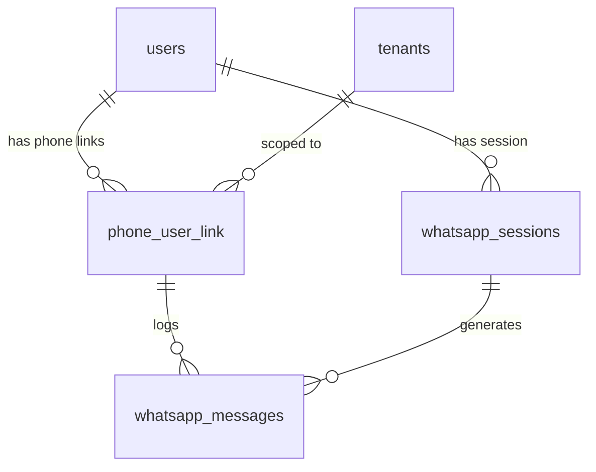
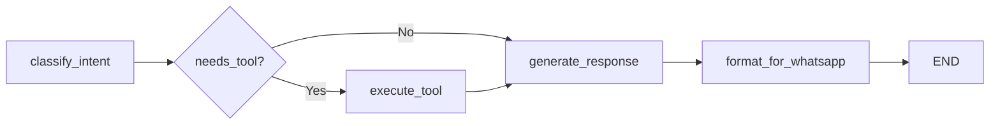

# VidyaOS — WhatsApp Conversational Access: Technical Integration Document

**Author:** Architecture Team  
**Date:** 2026-03-18  
**Status:** Design Specification  
**Audience:** Backend Engineers, DevOps, Product

---

## Table of Contents

1. [System Architecture Overview](#1-system-architecture-overview)
2. [WhatsApp Provider Recommendation](#2-whatsapp-provider-recommendation)
3. [Authentication Flow](#3-authentication-flow)
4. [Conversation Architecture](#4-conversation-architecture)
5. [Message Processing Pipeline](#5-message-processing-pipeline)
6. [WhatsApp Gateway Service](#6-whatsapp-gateway-service)
7. [Database Additions](#7-database-additions)
8. [API Endpoints](#8-api-endpoints)
9. [AI Integration (LangGraph)](#9-ai-integration-langgraph)
10. [Role-Based Access Control](#10-role-based-access-control)
11. [Message Format Design](#11-message-format-design)
12. [Scalability Design](#12-scalability-design)
13. [Security Design](#13-security-design)
14. [Deployment Architecture](#14-deployment-architecture)
15. [Implementation Roadmap](#15-implementation-roadmap)
16. [Example Conversation Flows](#16-example-conversation-flows)
17. [Message Routing Pseudocode](#17-message-routing-pseudocode)
18. [Developer Implementation Checklist](#18-developer-implementation-checklist)

---

## 1. System Architecture Overview

VidyaOS currently operates as a **Domain-Driven Modular Monolith** with the following topology:

```text
Next.js Frontend
    → FastAPI API (Bounded Contexts: Identity, Academic, Admin, AI Engine, Platform)
        → PostgreSQL (System of Record)
        → Redis (Queue + Session State)
        → LangGraph Agent Orchestrator (Autonomous AI Loop)
            → Ollama LLM (llama3.2)
            → FAISS Vector Store
        → Redis Worker (Heavy AI Jobs)
```

### Current WhatsApp Capability

VidyaOS already has an **outbound-only** WhatsApp integration in `src/domains/academic/services/whatsapp.py`:
- Uses **Meta WhatsApp Business Cloud API** (`graph.facebook.com/v18.0`)
- Sends attendance alerts, weekly digests, and exam results to parents
- Configured via `WHATSAPP_TOKEN` and `WHATSAPP_PHONE_NUMBER_ID` environment variables

### New Capability: Inbound Conversational Access

This document designs a **bidirectional** WhatsApp gateway that enables all four user roles (Student, Teacher, Parent, Admin) to interact with VidyaOS via natural language WhatsApp messages, powered by the existing LangGraph AI orchestration engine.

### Updated Architecture with WhatsApp Gateway

```text
WhatsApp User
    → Meta Cloud API (Webhook)
    → VidyaOS WhatsApp Gateway Service (NEW)
        → Signature Verification
        → Phone → User Mapping (Authentication)
        → Redis Session Manager
        → LangGraph AI Orchestrator
            → Intent Classification
            → ERP Tool Routing
            → Academic / Administrative / Identity Domain APIs
        → Response Formatter (Text / List / Media)
    → Meta Cloud API (Outbound)
    → WhatsApp User
```

---

## 2. WhatsApp Provider Recommendation

### Evaluation Matrix

| Criteria | Meta Cloud API | Twilio WhatsApp | WhatsApp Business API (On-Premises) |
|---|---|---|---|
| **Cost** | Free (up to 1,000 conversations/month) | $0.005/msg + carrier fees | High (server hosting) |
| **Setup Complexity** | Low (webhook + token) | Medium (account + TwiML) | Very High (Docker + certs) |
| **Rich Messages** | ✅ Lists, buttons, media, templates | ✅ Via Content API | ✅ Full |
| **Scalability** | Scales with Meta infrastructure | Scales with Twilio | Self-managed |
| **India Compliance** | ✅ (Meta data centers) | ✅ | ✅ |
| **Existing VidyaOS Integration** | ✅ Already in use | ❌ None | ❌ None |
| **Interactive Message Types** | ✅ Buttons, Lists, Flows | ✅ ContentSid | ✅ Full |
| **Webhook Verification** | SHA-256 HMAC | HMAC signature | Custom |

### Recommendation: **Meta WhatsApp Cloud API**

**Rationale:**
1. VidyaOS already uses Meta Cloud API for outbound notifications — zero migration cost
2. Free tier covers pilot deployments (1,000 free service conversations/month)
3. Native support for interactive messages (list menus, quick-reply buttons)
4. Direct webhook integration — no middleware proxy needed
5. India-compliant data residency

### Required Meta Configuration

| Item | Value |
|---|---|
| WhatsApp Business Account | Required (via Meta Business Suite) |
| System User Token | Long-lived token with `whatsapp_business_messaging` permission |
| Webhook URL | `https://{DOMAIN}/api/v1/whatsapp/webhook` |
| Verify Token | Shared secret for webhook registration |
| App Secret | For HMAC-SHA256 payload signature verification |

---

## 3. Authentication Flow

### 3.1 Phone-to-ERP Account Linking

Users must link their WhatsApp phone number to their VidyaOS ERP account before accessing any features.

```text
┌────────────────────────────────────────────────────────────┐
│                    FIRST-TIME LINKING                       │
├────────────────────────────────────────────────────────────┤
│                                                            │
│  User sends "Hi" to VidyaOS WhatsApp number               │
│       │                                                    │
│       ▼                                                    │
│  Gateway checks phone_user_link table                      │
│       │                                                    │
│       ▼  (Not Found)                                       │
│  Send: "Welcome to VidyaOS! To get started,               │
│         please enter your registered email address."       │
│       │                                                    │
│       ▼                                                    │
│  User sends: "student@school.com"                          │
│       │                                                    │
│       ▼                                                    │
│  Gateway looks up User by email in PostgreSQL              │
│  Generate 6-digit OTP → store in Redis (TTL: 5 min)       │
│  Send OTP to WhatsApp: "Your OTP is 482910"               │
│       │                                                    │
│       ▼                                                    │
│  User sends: "482910"                                      │
│       │                                                    │
│       ▼                                                    │
│  Gateway verifies OTP against Redis                        │
│  Create phone_user_link record                             │
│  Create whatsapp_session with JWT-equivalent claim         │
│  Send: "✅ Linked! You are logged in as Ravi (Student).   │
│         Type 'help' to see what I can do."                 │
│                                                            │
└────────────────────────────────────────────────────────────┘
```

### 3.2 Returning Users

```text
User sends message → Gateway finds phone_user_link → loads session → proceed to AI
```

No re-authentication unless:
- Session expired (configurable TTL, default 30 days)
- Admin revoked the phone link
- User sends `/logout`

### 3.3 Tenant Validation

Every `phone_user_link` record stores `tenant_id`. All subsequent ERP API calls are scoped to this tenant, enforcing strict data isolation identical to the web application.

### 3.4 Multi-Child Parent Linking

Parents with multiple children select the active child context:

```text
Parent: "Show attendance"
Bot: "Which child?
 1. Ravi Sharma (Class 8-A)
 2. Priya Sharma (Class 5-B)"
Parent: "1"
Bot: "Ravi's attendance this week: 100% ✅"
```

---

## 4. Conversation Architecture

### 4.1 Intent Classification Pipeline

Every inbound message passes through a 3-stage classification:

```text
Raw Message
    │
    ▼
┌──────────────────────────┐
│ Stage 1: Command Parser  │  Checks for exact commands (/help, /logout, /switch)
│ (Deterministic)          │  Fast path — no LLM needed
└──────────────────────────┘
    │ (not a command)
    ▼
┌──────────────────────────┐
│ Stage 2: Intent Router   │  LLM classifies intent category:
│ (LLM - llama3.2)        │  academic | administrative | ai_study | general
│                          │  Extracts: role, action, entities
└──────────────────────────┘
    │
    ▼
┌──────────────────────────┐
│ Stage 3: Tool Dispatcher │  Maps intent to ERP tool / domain API
│ (LangGraph Node)         │  Executes tool, formats response
└──────────────────────────┘
```

### 4.2 Supported Intent Categories

| Category | Example Queries | Target Domain |
|---|---|---|
| `academic.timetable` | "What's my timetable today?" | Academic |
| `academic.attendance` | "Show my attendance" | Academic |
| `academic.assignments` | "Pending assignments?" | Academic |
| `academic.exams` | "Any tests today?" | Academic |
| `academic.results` | "Show my marks" | Academic |
| `academic.weak_topics` | "What should I study?" | Academic |
| `admin.fees` | "Fee pending report" | Administrative |
| `admin.library` | "Any books on physics?" | Administrative |
| `admin.summary` | "School attendance summary" | Administrative |
| `ai.study` | "Generate quiz for class 8 science" | AI Engine |
| `ai.qa` | "Explain photosynthesis" | AI Engine |
| `system.help` | "help" | Gateway |
| `system.logout` | "/logout" | Gateway |

### 4.3 Conversation Session State

Each active conversation maintains state in Redis:

```json
{
  "session_id": "ws-a1b2c3d4",
  "phone": "919876543210",
  "user_id": "uuid-...",
  "tenant_id": "uuid-...",
  "role": "student",
  "active_child_id": null,
  "context_stack": [],
  "last_activity": "2026-03-18T10:30:00Z",
  "pending_action": null,
  "conversation_history": [
    {"role": "user", "content": "Show my timetable"},
    {"role": "assistant", "content": "Here is your timetable for Monday..."}
  ]
}
```

---

## 5. Message Processing Pipeline

### End-to-End Flow

```text
 ┌─────────────┐     ┌──────────────┐     ┌────────────────────┐
 │  WhatsApp    │────▷│ Meta Cloud   │────▷│ POST /whatsapp/    │
 │  User        │     │ API          │     │      webhook       │
 └─────────────┘     └──────────────┘     └────────┬───────────┘
                                                    │
                                          ┌─────────▼──────────┐
                                          │ Signature Verify   │
                                          │ (HMAC-SHA256)      │
                                          └─────────┬──────────┘
                                                    │
                                          ┌─────────▼──────────┐
                                          │ Phone Lookup       │
                                          │ (phone_user_link)  │
                                          └─────────┬──────────┘
                                                    │
                                      ┌─────────────▼─────────────┐
                                      │  Authenticated?           │
                                      │  YES → Load Session       │
                                      │  NO  → Start Auth Flow    │
                                      └─────────────┬─────────────┘
                                                    │ (authenticated)
                                          ┌─────────▼──────────┐
                                          │ LangGraph          │
                                          │ WhatsApp Agent     │
                                          │ (Intent → Tool)    │
                                          └─────────┬──────────┘
                                                    │
                                          ┌─────────▼──────────┐
                                          │ ERP Domain APIs    │
                                          │ (Academic / Admin)  │
                                          └─────────┬──────────┘
                                                    │
                                          ┌─────────▼──────────┐
                                          │ Response Formatter │
                                          │ (Text/List/Media)  │
                                          └─────────┬──────────┘
                                                    │
                                          ┌─────────▼──────────┐
                                          │ POST to Meta API   │
                                          │ (Outbound Message) │
                                          └─────────┬──────────┘
                                                    │
                                          ┌─────────▼──────────┐
                                          │ Log to             │
                                          │ whatsapp_messages  │
                                          └────────────────────┘
```

### Pipeline Stages (Detailed)

| Stage | Latency Target | Implementation |
|---|---|---|
| Webhook Receipt | <50ms | FastAPI async endpoint |
| Signature Verification | <5ms | HMAC-SHA256 with `APP_SECRET` |
| Phone Lookup | <10ms | Redis cache → PostgreSQL fallback |
| Session Load | <5ms | Redis `GET ws:{phone}` |
| LLM Intent Classification | <500ms | Ollama `llama3.2` (JSON mode) |
| ERP Tool Execution | <100ms | Direct SQLAlchemy query |
| Response Formatting | <10ms | Template engine |
| Outbound Send | <200ms | `httpx` to Meta Graph API |
| Message Logging | Async | Background task to PostgreSQL |

**Total target latency: <1 second** for simple ERP queries.

---

## 6. WhatsApp Gateway Service

### Service: `src/domains/platform/services/whatsapp_gateway.py`

This is a **new service** that acts as the central coordinator for all inbound WhatsApp traffic.

### Responsibilities

| Responsibility | Description |
|---|---|
| **Webhook Reception** | Receive and acknowledge Meta webhook payloads within 5 seconds |
| **Signature Verification** | Validate `X-Hub-Signature-256` header using `APP_SECRET` |
| **Phone → User Mapping** | Resolve WhatsApp phone to VidyaOS `User` via `phone_user_link` |
| **Session Management** | Create, load, update, and expire Redis-backed conversation sessions |
| **Auth Orchestration** | Drive the OTP linking flow for new users |
| **AI Dispatch** | Forward authenticated messages to the LangGraph WhatsApp agent |
| **Response Routing** | Format AI/ERP responses into WhatsApp-compatible message types |
| **Message Logging** | Persist all inbound/outbound messages to `whatsapp_messages` |
| **Rate Limiting** | Enforce per-user message rate limits to prevent abuse |

### Class Design

```python
class WhatsAppGateway:
    """Central coordinator for inbound/outbound WhatsApp messaging."""

    def __init__(self, db: Session, redis: Redis):
        self.db = db
        self.redis = redis
        self.agent = WhatsAppLangGraphAgent()

    async def handle_webhook(self, payload: dict) -> None:
        """Main entry point for Meta webhook events."""
        ...

    async def verify_signature(self, body: bytes, signature: str) -> bool:
        """HMAC-SHA256 payload verification."""
        ...

    async def resolve_user(self, phone: str) -> Optional[User]:
        """Map phone number to ERP user via phone_user_link."""
        ...

    async def get_or_create_session(self, phone: str) -> WhatsAppSession:
        """Load session from Redis or create a new one."""
        ...

    async def process_message(self, phone: str, text: str, session: WhatsAppSession) -> str:
        """Route message through auth check → AI agent → response."""
        ...

    async def send_response(self, phone: str, response: WhatsAppResponse) -> None:
        """Send formatted response via Meta Cloud API."""
        ...

    async def log_message(self, direction: str, phone: str, content: str, msg_type: str) -> None:
        """Persist message to whatsapp_messages table."""
        ...
```

---

## 7. Database Additions

### 7.1 `phone_user_link`

Links a WhatsApp phone number to a VidyaOS user account.

```sql
CREATE TABLE phone_user_link (
    id              UUID PRIMARY KEY DEFAULT gen_random_uuid(),
    phone           VARCHAR(20) NOT NULL,          -- E.164 format (e.g. "919876543210")
    user_id         UUID NOT NULL REFERENCES users(id) ON DELETE CASCADE,
    tenant_id       UUID NOT NULL REFERENCES tenants(id) ON DELETE CASCADE,
    verified        BOOLEAN NOT NULL DEFAULT FALSE,
    verified_at     TIMESTAMPTZ,
    created_at      TIMESTAMPTZ NOT NULL DEFAULT NOW(),
    updated_at      TIMESTAMPTZ NOT NULL DEFAULT NOW(),

    UNIQUE (phone, tenant_id)                      -- one phone per tenant
);

CREATE INDEX idx_phone_user_link_phone ON phone_user_link(phone);
```

### 7.2 `whatsapp_sessions`

Active conversation sessions (Redis is primary; PostgreSQL is durable backup).

```sql
CREATE TABLE whatsapp_sessions (
    id              UUID PRIMARY KEY DEFAULT gen_random_uuid(),
    phone           VARCHAR(20) NOT NULL,
    user_id         UUID NOT NULL REFERENCES users(id),
    tenant_id       UUID NOT NULL REFERENCES tenants(id),
    role            VARCHAR(20) NOT NULL,           -- student, teacher, parent, admin
    active_child_id UUID REFERENCES users(id),      -- for parent multi-child context
    session_data    JSONB NOT NULL DEFAULT '{}',     -- conversation_history, context_stack
    last_activity   TIMESTAMPTZ NOT NULL DEFAULT NOW(),
    expires_at      TIMESTAMPTZ NOT NULL,
    created_at      TIMESTAMPTZ NOT NULL DEFAULT NOW(),

    UNIQUE (phone)
);
```

### 7.3 `whatsapp_messages`

Audit log of all inbound and outbound messages.

```sql
CREATE TABLE whatsapp_messages (
    id              UUID PRIMARY KEY DEFAULT gen_random_uuid(),
    phone           VARCHAR(20) NOT NULL,
    user_id         UUID REFERENCES users(id),
    tenant_id       UUID REFERENCES tenants(id),
    direction       VARCHAR(10) NOT NULL,           -- 'inbound' | 'outbound'
    message_type    VARCHAR(20) NOT NULL DEFAULT 'text', -- text, list, image, audio, document
    content         TEXT NOT NULL,
    wa_message_id   VARCHAR(100),                   -- Meta's message ID
    intent          VARCHAR(50),                     -- classified intent (nullable)
    tool_called     VARCHAR(100),                    -- ERP tool invoked (nullable)
    latency_ms      INTEGER,                         -- response time
    status          VARCHAR(20) DEFAULT 'delivered', -- sent, delivered, read, failed
    created_at      TIMESTAMPTZ NOT NULL DEFAULT NOW()
);

CREATE INDEX idx_wa_messages_phone ON whatsapp_messages(phone);
CREATE INDEX idx_wa_messages_tenant ON whatsapp_messages(tenant_id);
CREATE INDEX idx_wa_messages_created ON whatsapp_messages(created_at);
```

### 7.4 `whatsapp_otp`

Temporary OTP storage (Redis is primary; this is the fallback schema).

```sql
CREATE TABLE whatsapp_otp (
    id              UUID PRIMARY KEY DEFAULT gen_random_uuid(),
    phone           VARCHAR(20) NOT NULL,
    email           VARCHAR(255) NOT NULL,
    otp_hash        VARCHAR(128) NOT NULL,           -- bcrypt hash of OTP
    attempts        INTEGER NOT NULL DEFAULT 0,
    expires_at      TIMESTAMPTZ NOT NULL,
    created_at      TIMESTAMPTZ NOT NULL DEFAULT NOW()
);
```

### Entity-Relationship Diagram



---

## 8. API Endpoints

### 8.1 Webhook Endpoint (Meta Cloud API)

```
POST /api/v1/whatsapp/webhook
```

Receives inbound messages from Meta. Must respond with `200 OK` within 5 seconds.

| Field | Source | Description |
|---|---|---|
| `X-Hub-Signature-256` | Header | HMAC-SHA256 signature |
| `entry[].changes[].value.messages[]` | Body | Inbound message array |

```
GET /api/v1/whatsapp/webhook?hub.mode=subscribe&hub.verify_token=...&hub.challenge=...
```

Webhook verification endpoint for Meta registration.

### 8.2 Manual Send Endpoint (Internal)

```
POST /api/v1/whatsapp/send
```

| Field | Type | Description |
|---|---|---|
| `phone` | string | Recipient phone (E.164) |
| `message` | string | Text body |
| `message_type` | enum | `text`, `list`, `buttons`, `template` |

**Auth:** Admin role required.

### 8.3 Session Management

```
GET /api/v1/whatsapp/sessions?phone=919876543210
```

Returns active session details for a phone number. **Auth:** Admin only.

```
DELETE /api/v1/whatsapp/sessions/{session_id}
```

Force-expire a session (e.g., on security concern). **Auth:** Admin only.

### 8.4 Phone Linking

```
POST /api/v1/whatsapp/link
```

| Field | Type | Description |
|---|---|---|
| `phone` | string | WhatsApp phone number |
| `email` | string | Registered ERP email |

Initiates OTP flow. Can also be triggered from the web UI settings page.

```
POST /api/v1/whatsapp/verify
```

| Field | Type | Description |
|---|---|---|
| `phone` | string | WhatsApp phone number |
| `otp` | string | 6-digit OTP |

Completes linking and creates `phone_user_link` record.

### 8.5 Analytics (Admin)

```
GET /api/v1/whatsapp/analytics
```

Returns WhatsApp usage metrics:
- Total messages (inbound/outbound) per day
- Active users by role
- Most used intents
- Average response latency

---

## 9. AI Integration (LangGraph)

### 9.1 WhatsApp Agent Graph

The WhatsApp conversational agent is a dedicated LangGraph `StateGraph` that extends the existing orchestrator pattern:

```python
class WhatsAppAgentState(TypedDict):
    phone: str
    user_id: str
    tenant_id: str
    role: str                    # student | teacher | parent | admin
    message: str                 # raw inbound message
    intent: Optional[str]        # classified intent
    tool_name: Optional[str]     # selected ERP tool
    tool_result: Optional[str]   # tool execution output
    response: Optional[str]      # formatted response text
    response_type: str           # text | list | buttons | media
    conversation_history: list   # last N messages for context
```

### 9.2 Graph Topology



### 9.3 WhatsApp-Specific ERP Tools

These tools extend the existing `erp_tools.py`:

| Tool Name | Role Access | Description |
|---|---|---|
| `get_student_timetable` | student | Today's class schedule |
| `get_student_tests` | student | Upcoming tests this week |
| `get_student_assignments` | student | Pending assignments with due dates |
| `get_student_attendance` | student | Attendance summary (this month) |
| `get_student_results` | student | Latest exam marks |
| `get_student_weak_topics` | student | Subjects below 60% |
| `get_teacher_schedule` | teacher | Today's teaching schedule |
| `get_teacher_absent_students` | teacher | Absentees from today's classes |
| `generate_quiz` | teacher | Trigger AI quiz generation (queued) |
| `get_child_performance` | parent | Child's academic summary |
| `get_child_attendance` | parent | Child's attendance this week |
| `get_child_homework` | parent | Pending assignments for child |
| `get_school_attendance_summary` | admin | School-wide attendance today |
| `get_fee_pending_report` | admin | Outstanding fee summary |
| `get_ai_usage_stats` | admin | AI query volume and trends |
| `check_library_catalog` | admin | Search library books (existing) |
| `get_school_financial_report` | admin | Fee collection report (existing) |

### 9.4 Tool Implementation Pattern

```python
@tool
def get_student_timetable(user_id: str, tenant_id: str) -> str:
    """Get today's class timetable for a student.

    Args:
        user_id: The student's UUID.
        tenant_id: The school tenant UUID.
    """
    db = SessionLocal()
    try:
        from src.domains.academic.routes.students import student_timetable
        # Direct service call, bypassing HTTP
        enrollment = db.query(Enrollment).filter(
            Enrollment.tenant_id == UUID(tenant_id),
            Enrollment.student_id == UUID(user_id),
        ).first()
        if not enrollment:
            return "You are not enrolled in any class."

        today = datetime.now().strftime("%A")
        slots = db.query(Timetable).filter(
            Timetable.tenant_id == UUID(tenant_id),
            Timetable.class_id == enrollment.class_id,
            Timetable.day_of_week == today,
        ).order_by(Timetable.start_time).all()

        if not slots:
            return f"No classes scheduled for {today}."

        lines = [f"📅 *{today}'s Timetable:*"]
        for s in slots:
            subject = db.query(Subject).get(s.subject_id)
            lines.append(f"  {s.start_time:%H:%M}–{s.end_time:%H:%M} | {subject.name if subject else 'TBD'}")
        return "\n".join(lines)
    finally:
        db.close()
```

---

## 10. Role-Based Access Control

### RBAC Enforcement Matrix

| Tool / Feature | Student | Teacher | Parent | Admin |
|---|---|---|---|---|
| View own timetable | ✅ | ✅ | ❌ | ❌ |
| View own attendance | ✅ | ❌ | ❌ | ❌ |
| View child's attendance | ❌ | ❌ | ✅ | ❌ |
| View school attendance | ❌ | ❌ | ❌ | ✅ |
| View pending assignments | ✅ | ❌ | ✅ (child) | ❌ |
| Generate quiz | ❌ | ✅ | ❌ | ❌ |
| View absent students | ❌ | ✅ | ❌ | ✅ |
| Fee pending report | ❌ | ❌ | ❌ | ✅ |
| AI study tools | ✅ | ❌ | ❌ | ❌ |
| Library search | ✅ | ✅ | ❌ | ✅ |

### Enforcement Implementation

```python
TOOL_ROLE_MAP = {
    "get_student_timetable": {"student"},
    "get_student_tests": {"student"},
    "get_student_attendance": {"student"},
    "get_child_performance": {"parent"},
    "get_child_attendance": {"parent"},
    "get_teacher_schedule": {"teacher"},
    "get_teacher_absent_students": {"teacher"},
    "generate_quiz": {"teacher"},
    "get_school_attendance_summary": {"admin"},
    "get_fee_pending_report": {"admin"},
    "get_ai_usage_stats": {"admin"},
    "check_library_catalog": {"student", "teacher", "admin"},
}

def authorize_tool(tool_name: str, user_role: str) -> bool:
    allowed = TOOL_ROLE_MAP.get(tool_name, set())
    return user_role in allowed
```

If a user requests a tool they don't have access to:

```text
Student: "Show me fee pending report"
Bot: "⚠️ Sorry, fee reports are only available to school administrators."
```

---

## 11. Message Format Design

### 11.1 Plain Text

Used for simple responses (timetable, attendance, marks):

```text
📅 *Monday's Timetable:*
  09:00–09:45 | Mathematics
  09:45–10:30 | Science
  11:00–11:45 | English
  11:45–12:30 | Hindi
```

### 11.2 Interactive List Messages

Used for multi-option selections (e.g., child selection for parents, subject choice):

```json
{
  "type": "interactive",
  "interactive": {
    "type": "list",
    "header": {"type": "text", "text": "Select Child"},
    "body": {"text": "Which child would you like to see?"},
    "action": {
      "button": "Choose",
      "sections": [{
        "title": "Your Children",
        "rows": [
          {"id": "child_1", "title": "Ravi Sharma", "description": "Class 8-A"},
          {"id": "child_2", "title": "Priya Sharma", "description": "Class 5-B"}
        ]
      }]
    }
  }
}
```

### 11.3 Quick Reply Buttons

Used for confirmations and follow-up actions:

```json
{
  "type": "interactive",
  "interactive": {
    "type": "button",
    "body": {"text": "Quiz generated for Class 8 Science. What next?"},
    "action": {
      "buttons": [
        {"type": "reply", "reply": {"id": "view_quiz", "title": "📝 View Quiz"}},
        {"type": "reply", "reply": {"id": "share_quiz", "title": "📤 Share with Class"}},
        {"type": "reply", "reply": {"id": "done", "title": "✅ Done"}}
      ]
    }
  }
}
```

### 11.4 Document Messages (PDF Reports)

Used for report cards, attendance reports, fee receipts:

```json
{
  "type": "document",
  "document": {
    "link": "https://vidyaos.app/api/v1/reports/download/{report_id}",
    "caption": "📄 Ravi Sharma — Report Card (March 2026)",
    "filename": "report_card_ravi_march_2026.pdf"
  }
}
```

### 11.5 Audio Messages

Used for parent audio summaries (leveraging existing TTS infrastructure):

```json
{
  "type": "audio",
  "audio": {
    "link": "https://vidyaos.app/api/v1/audio/{audio_id}.mp3"
  }
}
```

### 11.6 Template Messages

Used for proactive notifications (attendance alerts, exam results):

```json
{
  "type": "template",
  "template": {
    "name": "attendance_alert_v1",
    "language": {"code": "en"},
    "components": [{
      "type": "body",
      "parameters": [
        {"type": "text", "text": "Ravi Sharma"},
        {"type": "text", "text": "absent"},
        {"type": "text", "text": "2026-03-18"}
      ]
    }]
  }
}
```

---

## 12. Scalability Design

### 12.1 Redis Session Storage

```text
Key:    ws:session:{phone}
Value:  JSON blob (WhatsAppSession)
TTL:    30 days (configurable via WA_SESSION_TTL_DAYS)
```

```text
Key:    ws:otp:{phone}
Value:  hashed OTP + email
TTL:    300 seconds (5 minutes)
```

```text
Key:    ws:ratelimit:{phone}
Value:  message count
TTL:    60 seconds (sliding window)
```

### 12.2 Queue Workers for Heavy Operations

Heavy AI operations (quiz generation, study guides, audio overviews) are **not** executed synchronously in the webhook handler. Instead:

```text
WhatsApp Message → Gateway detects heavy intent
    → Enqueue job to Redis queue (existing ai_worker.py)
    → Send immediate acknowledgment: "⏳ Generating your quiz... I'll send it when ready."
    → Worker completes job → triggers outbound WhatsApp message via callback
```

### 12.3 Webhook Retry Handling

Meta retries failed webhooks with exponential backoff. The gateway must:
1. Always respond `200 OK` within 5 seconds
2. Use message deduplication via `wa_message_id` to prevent double-processing
3. Process messages asynchronously after acknowledging

```python
@router.post("/whatsapp/webhook")
async def whatsapp_webhook(request: Request, background_tasks: BackgroundTasks):
    body = await request.body()
    if not verify_signature(body, request.headers.get("X-Hub-Signature-256", "")):
        raise HTTPException(status_code=403, detail="Invalid signature")

    payload = await request.json()
    # Acknowledge immediately
    background_tasks.add_task(process_whatsapp_payload, payload)
    return {"status": "ok"}
```

### 12.4 Rate Limiting

| Limit | Value | Scope |
|---|---|---|
| Messages per minute | 10 | Per phone number |
| Messages per hour | 60 | Per phone number |
| OTP attempts | 3 | Per phone, per 15 minutes |
| Session creation | 5 | Per phone, per day |

---

## 13. Security Design

### 13.1 Webhook Signature Verification

Every inbound webhook is verified using HMAC-SHA256:

```python
import hmac, hashlib

def verify_signature(payload: bytes, signature: str) -> bool:
    app_secret = os.getenv("WHATSAPP_APP_SECRET", "")
    expected = "sha256=" + hmac.new(
        app_secret.encode(), payload, hashlib.sha256
    ).hexdigest()
    return hmac.compare_digest(expected, signature)
```

### 13.2 Phone Verification (OTP)

- OTP is 6-digit, cryptographically random (`secrets.randbelow(900000) + 100000`)
- Stored as bcrypt hash in Redis with 5-minute TTL
- Maximum 3 attempts before lockout (15-minute cooldown)
- OTP is sent via the WhatsApp conversation itself (not SMS — saves cost)

### 13.3 Tenant Isolation

All database queries include `tenant_id` filter. The WhatsApp gateway inherits the same tenant scoping as the web API:

```python
# Every tool call receives tenant_id from the authenticated session
timetable = db.query(Timetable).filter(
    Timetable.tenant_id == session.tenant_id,  # ALWAYS scoped
    ...
).all()
```

### 13.4 Abuse Prevention

| Threat | Mitigation |
|---|---|
| Message flooding | Redis rate limiter (10/min, 60/hr per phone) |
| Unauthorized access | OTP verification + phone_user_link check |
| Session hijacking | Sessions bound to specific phone numbers |
| Prompt injection | System prompt hardening + output sanitization |
| Data exfiltration | RBAC tool authorization + read-only ERP access |
| Replay attacks | `wa_message_id` deduplication |

### 13.5 Audit Trail

Every WhatsApp interaction is logged in `whatsapp_messages` with:
- Direction (inbound/outbound)
- Classified intent
- Tool called
- Response latency
- User and tenant association

Admins can view WhatsApp activity via the existing admin dashboard analytics endpoints.

---

## 14. Deployment Architecture

### Updated Docker Compose Topology

```text
┌───────────────────────────────────────────────────────────────┐
│                          Internet                             │
│                                                               │
│   ┌──────────┐     ┌───────────┐     ┌────────────────────┐  │
│   │ Browser  │     │ WhatsApp  │     │ Meta Cloud API     │  │
│   │ (Next.js)│     │ Users     │     │ (Webhooks)         │  │
│   └────┬─────┘     └─────┬─────┘     └────────┬───────────┘  │
│        │                  │                     │              │
│        └──────────┬───────┘─────────────────────┘              │
│                   │                                            │
│             ┌─────▼─────┐                                     │
│             │   NGINX   │  (TLS termination, routing)         │
│             └─────┬─────┘                                     │
│                   │                                            │
│     ┌─────────────▼──────────────┐                            │
│     │     FastAPI API            │                            │
│     │  ┌─────────────────────┐   │                            │
│     │  │ Identity Domain     │   │                            │
│     │  │ Academic Domain     │   │                            │
│     │  │ Admin Domain        │   │                            │
│     │  │ AI Engine Domain    │   │                            │
│     │  │ Platform Domain     │   │                            │
│     │  │ ┌─────────────────┐ │   │                            │
│     │  │ │ WhatsApp Gateway│ │   │  ◄── NEW                  │
│     │  │ └─────────────────┘ │   │                            │
│     │  └─────────────────────┘   │                            │
│     └─────┬──────┬──────┬────────┘                            │
│           │      │      │                                     │
│     ┌─────▼──┐ ┌─▼───┐ ┌▼──────┐                             │
│     │Postgres│ │Redis│ │Ollama │                              │
│     └────────┘ └──┬──┘ └───────┘                              │
│                   │                                            │
│             ┌─────▼─────┐                                     │
│             │  Worker   │  (Heavy AI jobs → WhatsApp callback)│
│             └───────────┘                                     │
│                                                               │
└───────────────────────────────────────────────────────────────┘
```

### New Environment Variables

```env
# WhatsApp Gateway (add to .env)
WHATSAPP_APP_SECRET=your_meta_app_secret
WHATSAPP_VERIFY_TOKEN=your_webhook_verify_token
WHATSAPP_TOKEN=your_system_user_token
WHATSAPP_PHONE_NUMBER_ID=your_phone_number_id
WA_SESSION_TTL_DAYS=30
WA_RATE_LIMIT_PER_MINUTE=10
WA_OTP_TTL_SECONDS=300
WA_OTP_MAX_ATTEMPTS=3
```

### NGINX Addition

```nginx
location /api/v1/whatsapp/ {
    proxy_pass http://api:8000/api/v1/whatsapp/;
    proxy_read_timeout 10s;    # Meta requires response within 5s
    proxy_set_header X-Real-IP $remote_addr;
    proxy_set_header X-Hub-Signature-256 $http_x_hub_signature_256;
}
```

---

## 15. Implementation Roadmap

### Phase 1 — Authentication & Phone Linking (Week 1-2)

| Task | Priority | Effort |
|---|---|---|
| Create `phone_user_link` and `whatsapp_messages` tables | 🔴 | 2h |
| Implement webhook verification endpoint | 🔴 | 3h |
| Build OTP generation and verification flow | 🔴 | 4h |
| Implement phone → user resolution service | 🔴 | 3h |
| Redis session management (create/load/expire) | 🔴 | 3h |
| Add phone linking UI to web app settings page | 🟡 | 4h |
| Write tests for auth flow | 🔴 | 3h |

### Phase 2 — Student Features (Week 3)

| Task | Priority | Effort |
|---|---|---|
| Implement `get_student_timetable` tool | 🔴 | 2h |
| Implement `get_student_tests` tool | 🔴 | 2h |
| Implement `get_student_assignments` tool | 🔴 | 2h |
| Implement `get_student_attendance` tool | 🔴 | 2h |
| Implement `get_student_results` tool | 🟡 | 2h |
| Build LangGraph WhatsApp agent (intent → tool → response) | 🔴 | 6h |
| Response formatter for text, lists, buttons | 🔴 | 3h |

### Phase 3 — Teacher & Parent Features (Week 4)

| Task | Priority | Effort |
|---|---|---|
| Implement teacher tools (schedule, absentees) | 🔴 | 4h |
| Implement `generate_quiz` queued tool | 🟡 | 3h |
| Implement parent tools (multi-child context) | 🔴 | 4h |
| Child selection flow (list message) | 🟡 | 2h |
| PDF report delivery via WhatsApp (report cards) | 🟡 | 3h |

### Phase 4 — Admin Analytics (Week 5)

| Task | Priority | Effort |
|---|---|---|
| Implement admin tools (attendance summary, fee report) | 🔴 | 4h |
| Integrate existing `erp_tools.py` (library, financial) | 🟡 | 2h |
| WhatsApp analytics dashboard endpoint | 🟡 | 3h |
| Admin session management UI | 🟡 | 3h |

### Phase 5 — AI Conversational Mode (Week 6)

| Task | Priority | Effort |
|---|---|---|
| Connect WhatsApp agent to full RAG pipeline | 🟡 | 4h |
| Enable study tool generation via WhatsApp | 🟡 | 3h |
| Audio summary delivery (MP3 via WhatsApp) | 🟢 | 3h |
| Conversation memory (multi-turn context) | 🟡 | 3h |
| Hindi/Marathi language support | 🟡 | 2h |

**Total estimated effort: ~85 engineering hours (∼2 developer-months)**

---

## 16. Example Conversation Flows

### Flow 1: Student Checks Timetable

```text
Student: "Do I have any classes today?"
         │
         ▼
[Webhook] → [Signature OK] → [Phone Lookup: 919876543210 → Ravi (student)]
         │
         ▼
[LangGraph: classify_intent]
  → intent: "academic.timetable"
  → tool: "get_student_timetable"
         │
         ▼
[Tool Execution]
  → Query Enrollment → Query Timetable for Monday
  → 4 slots found
         │
         ▼
[Response Formatter: plain text]
         │
         ▼
Bot: "📅 *Monday's Timetable:*
      09:00–09:45 | Mathematics
      09:45–10:30 | Science
      11:00–11:45 | English
      11:45–12:30 | Hindi"
```

### Flow 2: Parent Checks Child's Attendance (Multi-Child)

```text
Parent: "Show attendance"
         │
         ▼
[Session loaded: 2 children linked]
         │
         ▼
Bot: [Interactive List Message]
     "Which child?"
     1. Ravi Sharma (Class 8-A)
     2. Priya Sharma (Class 5-B)
         │
         ▼
Parent: taps "Ravi Sharma"
         │
         ▼
[Tool: get_child_attendance(child_id=ravi, tenant_id=...)]
         │
         ▼
Bot: "📊 *Ravi's Attendance (March 2026):*
      Present: 18/20 days (90%)
      Absent: 2 days (Mar 5, Mar 12)
      Status: ✅ Good"
```

### Flow 3: Teacher Generates Quiz

```text
Teacher: "Generate quiz for class 8 science"
         │
         ▼
[LangGraph: classify_intent]
  → intent: "ai.study"
  → tool: "generate_quiz"
  → params: {class: "8", subject: "science"}
         │
         ▼
[Heavy operation → enqueue to Redis worker]
         │
         ▼
Bot: "⏳ Generating a science quiz for Class 8...
      I'll send it when ready (usually ~30 seconds)."
         │
         ▼  (30 seconds later, worker callback)
         │
Bot: "✅ Quiz ready! 10 questions on Plant Biology.

      📝 *Q1:* What is the primary pigment in photosynthesis?
      A) Chlorophyll  B) Carotenoid  C) Xanthophyll  D) Anthocyanin

      [View Full Quiz] [Share with Class] [Done]"
```

### Flow 4: Admin Fee Report

```text
Admin: "Who hasn't paid fees?"
         │
         ▼
[LangGraph: classify_intent]
  → intent: "admin.fees"
  → tool: "get_fee_pending_report"
         │
         ▼
Bot: "💰 *Fee Pending Report (March 2026):*
      Total Outstanding: ₹2,45,000
      Students with dues: 23/180
      Most overdue: Ravi Sharma (₹15,000, 45 days)

      [Download Full Report] [Send Reminders]"
```

---

## 17. Message Routing Pseudocode

```python
async def process_whatsapp_message(phone: str, text: str) -> WhatsAppResponse:
    """Main message routing pipeline."""

    # 1. Resolve user
    user_link = await resolve_phone_to_user(phone)
    if not user_link:
        return await start_auth_flow(phone, text)

    # 2. Load session
    session = await load_or_create_session(phone, user_link)

    # 3. Check for pending auth action (OTP verification)
    if session.pending_action == "awaiting_otp":
        return await verify_otp(phone, text, session)
    if session.pending_action == "awaiting_email":
        return await lookup_email_and_send_otp(phone, text, session)
    if session.pending_action == "awaiting_child_selection":
        return await select_child(phone, text, session)

    # 4. Check for system commands
    if text.strip().lower() in SYSTEM_COMMANDS:
        return await handle_system_command(text, session)

    # 5. Rate limit check
    if await is_rate_limited(phone):
        return WhatsAppResponse(
            type="text",
            body="⚠️ Too many messages. Please wait a moment."
        )

    # 6. Run LangGraph WhatsApp Agent
    state = {
        "phone": phone,
        "user_id": str(user_link.user_id),
        "tenant_id": str(user_link.tenant_id),
        "role": session.role,
        "message": text,
        "conversation_history": session.conversation_history[-10:],
        "intent": None,
        "tool_name": None,
        "tool_result": None,
        "response": None,
        "response_type": "text",
    }

    result = whatsapp_agent_graph.invoke(state)

    # 7. Check if heavy operation (queue it)
    if result.get("tool_name") in HEAVY_TOOLS:
        await enqueue_heavy_tool(result, phone, session)
        return WhatsAppResponse(
            type="text",
            body="⏳ Working on it... I'll message you when ready."
        )

    # 8. Update session history
    session.conversation_history.append({"role": "user", "content": text})
    session.conversation_history.append({"role": "assistant", "content": result["response"]})
    await save_session(session)

    # 9. Log message
    await log_message("inbound", phone, text, intent=result.get("intent"))
    await log_message("outbound", phone, result["response"], tool=result.get("tool_name"))

    # 10. Return formatted response
    return WhatsAppResponse(
        type=result.get("response_type", "text"),
        body=result["response"]
    )
```

---

## 18. Developer Implementation Checklist

### Infrastructure

- [ ] Register Meta WhatsApp Business Account
- [ ] Create System User with `whatsapp_business_messaging` permission
- [ ] Configure webhook URL in Meta App Dashboard
- [ ] Set `WHATSAPP_APP_SECRET`, `WHATSAPP_VERIFY_TOKEN` in `.env`
- [ ] Add NGINX proxy rule for `/api/v1/whatsapp/`

### Database

- [ ] Create Alembic migration for `phone_user_link` table
- [ ] Create Alembic migration for `whatsapp_sessions` table
- [ ] Create Alembic migration for `whatsapp_messages` table
- [ ] Create Alembic migration for `whatsapp_otp` table (fallback)
- [ ] Add database indexes for phone lookups

### Backend Services

- [ ] Implement `WhatsAppGateway` service class (`src/domains/platform/services/whatsapp_gateway.py`)
- [ ] Implement webhook verification (GET + POST endpoints)
- [ ] Implement HMAC-SHA256 signature verification
- [ ] Implement OTP generation and verification service
- [ ] Implement Redis session manager (`ws:session:{phone}`)
- [ ] Implement phone → user resolution with Redis cache
- [ ] Implement rate limiter (`ws:ratelimit:{phone}`)
- [ ] Implement message deduplication by `wa_message_id`

### AI / LangGraph

- [ ] Define `WhatsAppAgentState` TypedDict
- [ ] Implement `classify_intent` node (LLM-based)
- [ ] Implement `execute_tool` node with RBAC enforcement
- [ ] Implement `format_for_whatsapp` node (text/list/buttons/media)
- [ ] Build and compile `whatsapp_agent_graph` StateGraph
- [ ] Register all 17 WhatsApp-specific ERP tools
- [ ] Connect heavy operations to existing Redis queue worker

### ERP Tools

- [ ] `get_student_timetable`
- [ ] `get_student_tests`
- [ ] `get_student_assignments`
- [ ] `get_student_attendance`
- [ ] `get_student_results`
- [ ] `get_student_weak_topics`
- [ ] `get_teacher_schedule`
- [ ] `get_teacher_absent_students`
- [ ] `generate_quiz` (queued)
- [ ] `get_child_performance`
- [ ] `get_child_attendance`
- [ ] `get_child_homework`
- [ ] `get_school_attendance_summary`
- [ ] `get_fee_pending_report`
- [ ] `get_ai_usage_stats`

### Routes

- [ ] `POST /api/v1/whatsapp/webhook` (inbound messages)
- [ ] `GET /api/v1/whatsapp/webhook` (Meta verification)
- [ ] `POST /api/v1/whatsapp/send` (admin manual send)
- [ ] `POST /api/v1/whatsapp/link` (initiate phone linking)
- [ ] `POST /api/v1/whatsapp/verify` (complete OTP verification)
- [ ] `GET /api/v1/whatsapp/sessions` (admin session list)
- [ ] `DELETE /api/v1/whatsapp/sessions/{id}` (force logout)
- [ ] `GET /api/v1/whatsapp/analytics` (usage metrics)

### Frontend (Web App)

- [ ] Add "Link WhatsApp" button to user settings page
- [ ] Phone number input with country code picker
- [ ] OTP verification modal
- [ ] Admin WhatsApp analytics dashboard widget

### Testing

- [ ] Unit tests for signature verification
- [ ] Unit tests for OTP flow (generation, verification, expiry, lockout)
- [ ] Unit tests for phone → user resolution
- [ ] Unit tests for rate limiting
- [ ] Integration tests for webhook → gateway → response pipeline
- [ ] Integration tests for each ERP tool
- [ ] Integration tests for RBAC enforcement (unauthorized tool access)
- [ ] Load test: 100 concurrent webhook payloads

### Monitoring

- [ ] Add Prometheus metrics: `wa_messages_total`, `wa_latency_seconds`, `wa_auth_failures`
- [ ] Add Grafana dashboard panel for WhatsApp traffic
- [ ] Add alert rule for webhook failure rate > 5%
- [ ] Add audit log entries for phone linking events

### Documentation

- [ ] Update `README.md` with WhatsApp feature section
- [ ] Update `feature_guide.md` with WhatsApp conversational access
- [ ] Add WhatsApp setup instructions to `quickstart.md`
- [ ] Document Meta App Dashboard configuration steps

---

> **End of Document**
>
> This specification provides a complete, production-ready blueprint for adding WhatsApp conversational access to VidyaOS. The design leverages existing infrastructure (Meta Cloud API, LangGraph, Redis, Domain-Driven FastAPI) to minimize new dependencies while maximizing feature coverage across all four user roles.
